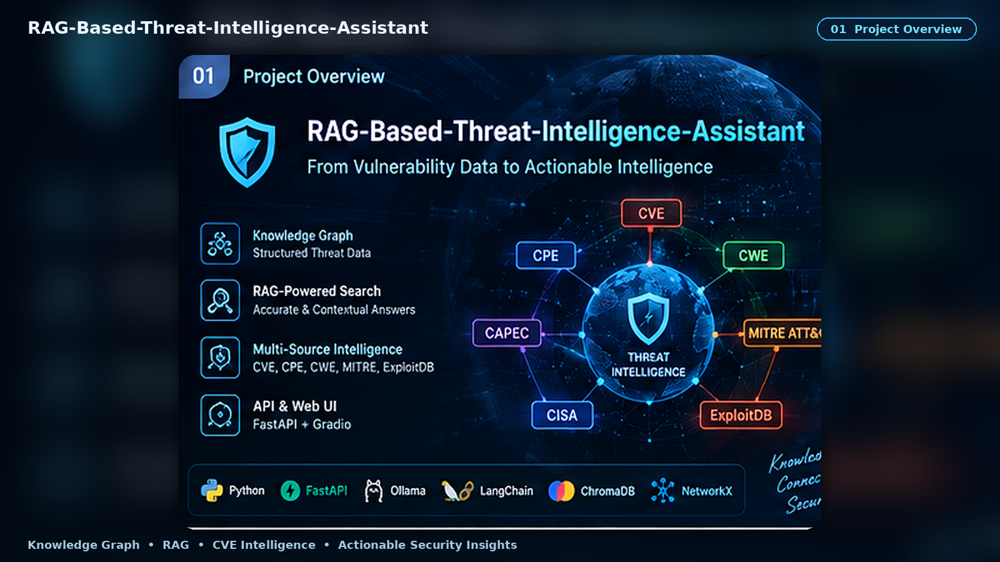
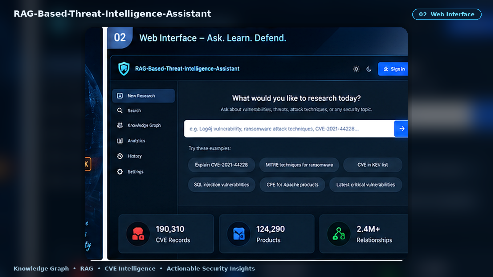
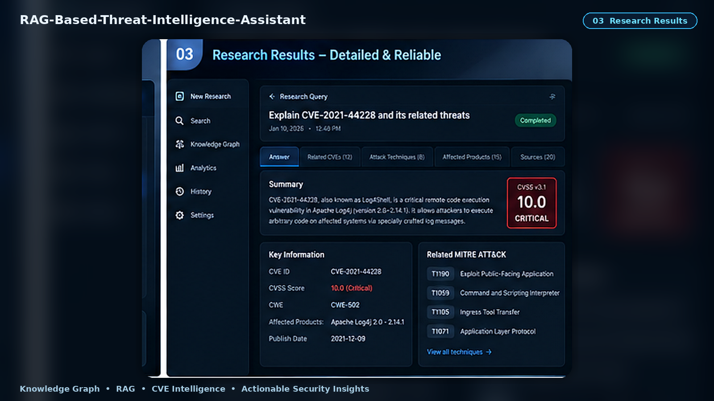
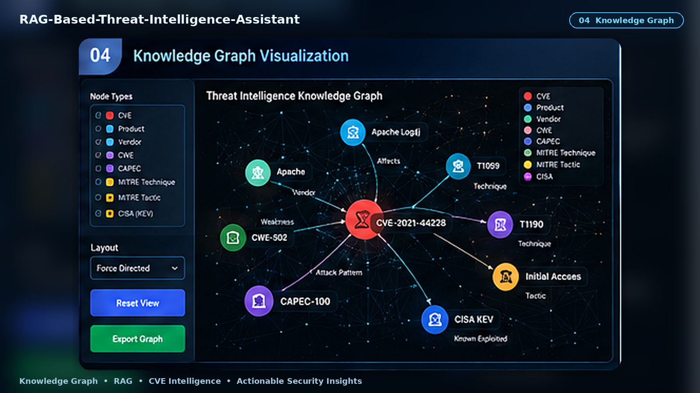
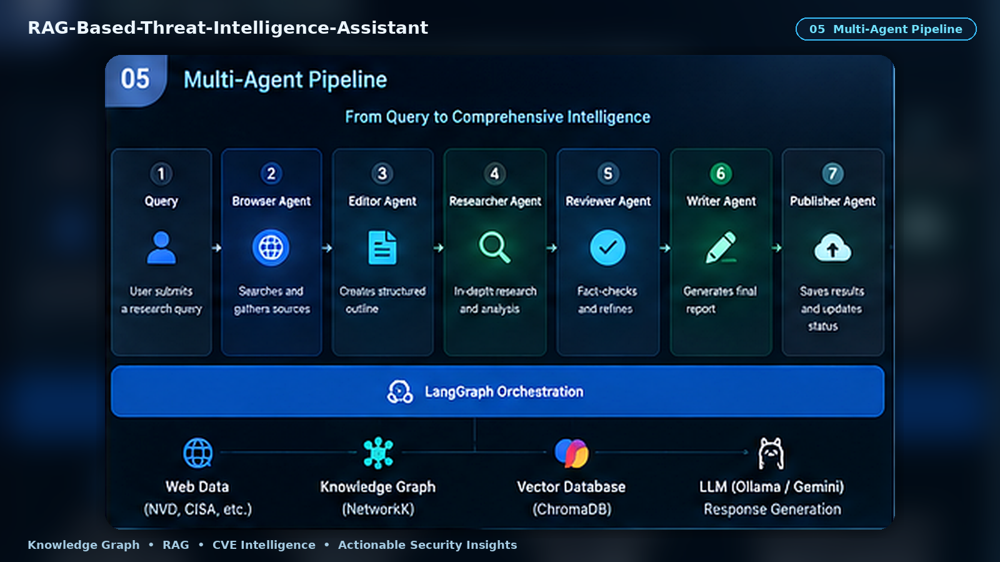
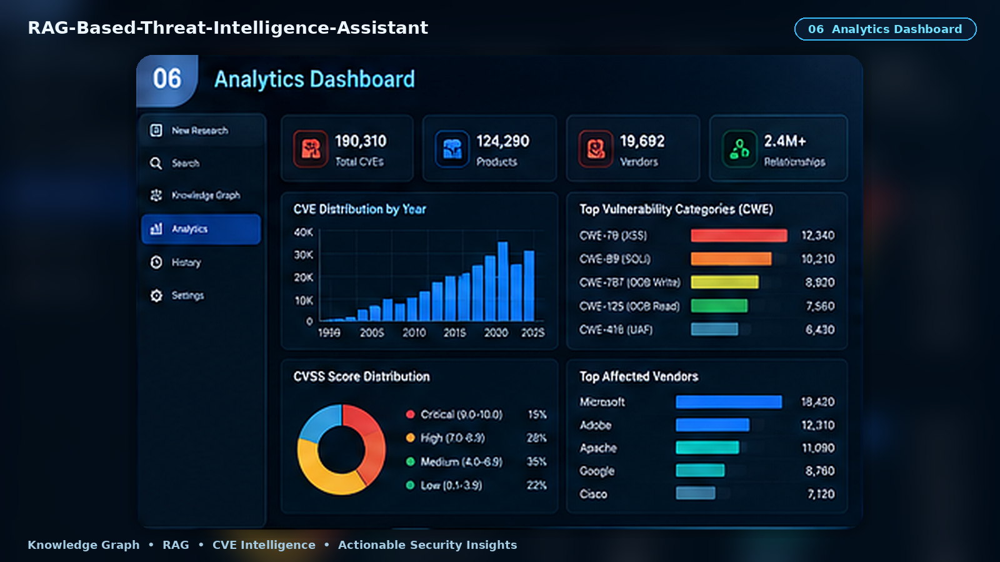
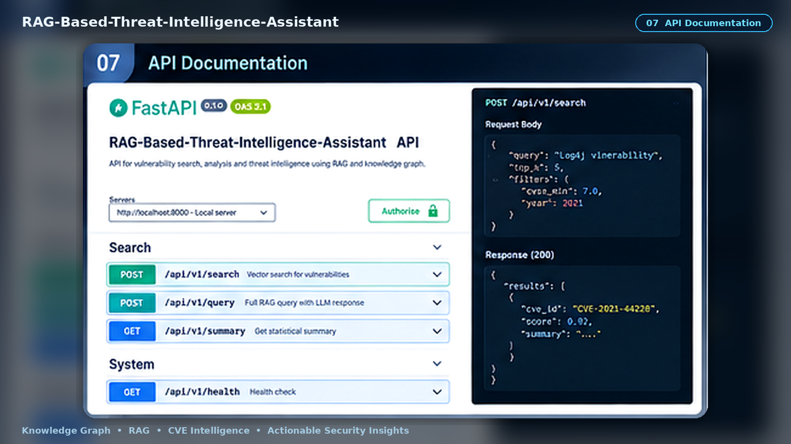
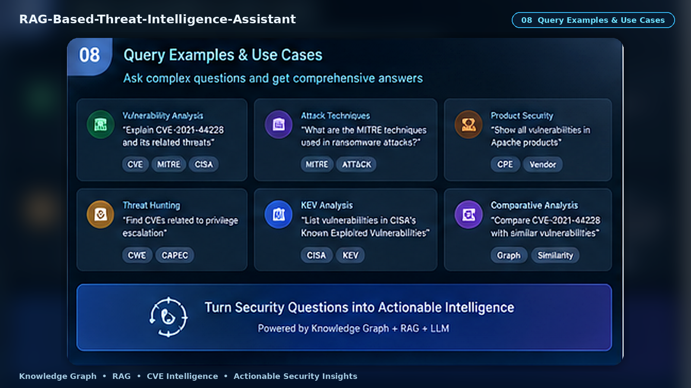
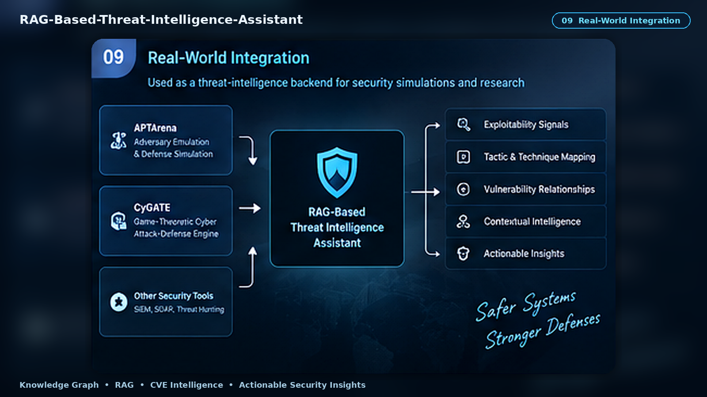
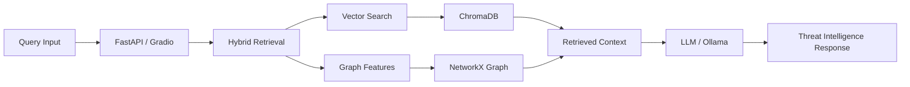

<p align="center">
  
</p>

<h1 align="center">RAG-Based-Threat-Intelligence-Assistant</h1>

<p align="center">
  <strong>Knowledge Graph + Enhanced RAG for vulnerability intelligence, semantic search, threat correlation, and explainable cybersecurity research.</strong>
</p>

<p align="center">
  
  
  
  
  
  
  
  
</p>

<p align="center">
  <a href="#-one-line-idea">One-line idea</a> •
  <a href="#-product-preview">Preview</a> •
  <a href="#-what-makes-it-different">Why this project</a> •
  <a href="#-architecture-overview">Architecture</a> •
  <a href="#-quick-start">Quick Start</a> •
  <a href="#-project-structure">Structure</a> •
  <a href="#-api-endpoints">API</a>
</p>

---

## ✦ One-line idea

> **RAG-Based-Threat-Intelligence-Assistant transforms large-scale vulnerability and threat datasets into connected, searchable, and explainable security intelligence by combining a knowledge graph with graph-enhanced retrieval and LLM generation.**

A standard vulnerability search often looks like this:

```text
QUERY
  ↓
KEYWORD SEARCH
  ↓
MATCHED RECORDS
```

This project extends the workflow:

```text
CVE / CPE / CWE / CAPEC / MITRE / CISA / ExploitDB
                         ↓
                DATA COLLECTION
                         ↓
               PROCESS + ENRICH
                         ↓
                KNOWLEDGE GRAPH
                         ↓
          NETWORKX GRAPH FEATURES
                         ↓
             VECTOR EMBEDDINGS
                         ↓
               HYBRID RETRIEVAL
                         ↓
                  LLM RESPONSE
                         ↓
       CONTEXTUAL THREAT INTELLIGENCE
```

---

# ✨ Product Preview

> [!NOTE]
> The images below are standalone repository visuals representing the main workflows of the threat-intelligence assistant.

<table>
<tr>
<td width="50%" valign="top">

### 1. Project Overview


The full product concept: multi-source intelligence, knowledge graph relationships, RAG search, FastAPI access, and a security-focused interface.

</td>
<td width="50%" valign="top">

### 2. Web Interface



Ask questions about vulnerabilities, products, attack techniques, and security topics from one research interface.

</td>
</tr>
<tr>
<td width="50%" valign="top">

### 3. Research Results



Review structured answers with severity, vulnerability details, related techniques, affected products, and supporting context.

</td>
<td width="50%" valign="top">

### 4. Knowledge Graph Visualization



Explore relationships between CVEs, products, vendors, CWEs, CAPECs, MITRE techniques, tactics, and exploitation signals.

</td>
</tr>
<tr>
<td width="50%" valign="top">

### 5. Multi-Agent / RAG Pipeline



Visualize the path from query handling to research, review, synthesis, retrieval, and response generation.

</td>
<td width="50%" valign="top">

### 6. Analytics Dashboard



Inspect vulnerability trends, CVSS coverage, affected vendors, CWE categories, and global graph statistics.

</td>
</tr>
<tr>
<td width="50%" valign="top">

### 7. API Documentation



Use the FastAPI interface for RAG queries, vector search, statistics, and system health checks.

</td>
<td width="50%" valign="top">

### 8. Query Examples & Use Cases



Support vulnerability analysis, threat hunting, KEV analysis, product security, and comparative research scenarios.

</td>
</tr>
</table>

### 9. Real-World Integration

<p align="center">
  
</p>

The system can act as a threat-intelligence backend for security simulation and research workflows that need exploitability signals, tactic mappings, and vulnerability relationship context.

---

# 🧠 What Makes It Different

<table>
<tr>
<td width="25%" align="center">
<h3>01</h3>
<b>Graph + RAG</b><br/>
Semantic retrieval is enriched with explicit vulnerability relationships.
</td>
<td width="25%" align="center">
<h3>02</h3>
<b>Multi-Source Intelligence</b><br/>
CVE, CPE, CWE, CAPEC, MITRE ATT&CK, ExploitDB, CISA KEV, and related data are correlated.
</td>
<td width="25%" align="center">
<h3>03</h3>
<b>Large-Scale Coverage</b><br/>
The dataset snapshot spans vulnerability information from 1999 through 2025.
</td>
<td width="25%" align="center">
<h3>04</h3>
<b>Multiple Access Layers</b><br/>
Use command-line workflows, FastAPI endpoints, or the optional Gradio UI.
</td>
</tr>
</table>

---

# 📊 Dataset Snapshot (1999–2025)

## Knowledge Graph Coverage

- **190,310 CVEs** with CVSS, affected products, CWE, CAPEC, and MITRE mappings
- **124,290 products** from **19,692 vendors**
- **458 CWEs**
- **428 CAPECs**
- **169 MITRE techniques**
- **37 MITRE tactics**
- **2.4M+ relationships** between entities
- **152,676 CVEs** with CVSS v3 coverage (**80%**)
- **1,060 CVEs** in the CISA Known Exploited Vulnerabilities list

## NetworkX Graph Statistics

- **335,178 nodes**
- **1,126,306 edges**
- **246 vulnerability clusters** based on CWE and product relationships
- **Graph density:** `0.000010`

> [!NOTE]
> These figures reflect the dataset snapshot documented for the 1999–2025 collection window.

---

# 🏗 Architecture Overview

## Data Pipeline

```text
Raw CVE Data (NVD)
        ↓
Processed CVE Data
        ↓
CPE Extraction
        ↓
Knowledge Graph
        ↓
NetworkX Graph
        ↓
Vector Database
        ↓
RAG / Search / API / UI
```

## Knowledge Graph Structure

```text
Nodes
├── CVEs
├── Products
├── Vendors
├── CWEs
├── CAPECs
├── MITRE Techniques
└── MITRE Tactics

Relationships
├── CVE → Product
├── CVE → CWE
├── CVE → CAPEC
├── CVE → MITRE Technique
└── Product → Vendor
```

## Enhanced RAG Architecture



---

# 🔥 Core Capabilities

## 1. Threat-Intelligence Collection

The collection pipeline brings together vulnerability and adversary context from sources such as:

```text
NVD CVE
CPE
CWE
CAPEC
MITRE ATT&CK
ExploitDB
CISA KEV
Other enrichment sources
```

## 2. Knowledge Graph Construction

The graph preserves structured security relationships rather than flattening every record into independent text chunks.

Examples:

```text
CVE → affected product
CVE → weakness
CVE → attack pattern
CVE → MITRE technique
Product → vendor
CVE → exploitation signal
```

## 3. NetworkX Graph Features

NetworkX is used for graph processing such as:

- graph construction
- similarity features
- graph statistics
- centrality calculations
- relationship-driven context
- vulnerability clustering

## 4. Graph-Enhanced Vector Retrieval

The project exports graph data for RAG and builds a vector database with graph-enhanced embeddings.

```text
Knowledge Graph
     ↓
RAG Export
     ↓
Embeddings
     ↓
ChromaDB
     ↓
Semantic Search
```

## 5. LLM Response Generation

Ollama-hosted models can be used for local generation.

Recommended model commands from the documented workflow:

```bash
ollama pull llama3.1:8b
ollama pull llama3.1:70b
```

The larger model is optional for higher-quality responses when hardware permits.

## 6. Optional Fine-Tuning Pipeline

The repository also includes an optional model-training workflow:

```text
Knowledge Graph
      ↓
Dataset Preparation
      ↓
Data Analysis
      ↓
System Check
      ↓
Production Training
      ↓
Inference Test
```

---

# 📁 Project Structure

The following layout reflects the key paths referenced by the repository workflow:

```text
RAG-Based-Threat-Intelligence-Assistant/
│
├── config.py
├── requirements.txt
├── README.md
│
├── scripts/
│   └── download_all_cves.py
│
├── src/
│   ├── collectors/
│   │   └── main_collector.py
│   │
│   ├── processors/
│   │   └── process_all_cves.py
│   │
│   ├── constructors/
│   │   ├── run_cpe_extraction.py
│   │   ├── kg_builder_without_neo4j.py
│   │   ├── networkx_graph_builder.py
│   │   └── neo4j_queries.md
│   │
│   ├── generators/
│   │   ├── export_kg_for_rag_direct.py
│   │   ├── rag_system.py
│   │   └── rag_config.py
│   │
│   ├── training/
│   │   ├── dataset_preparation.py
│   │   ├── run_data_analysis.py
│   │   ├── system_check.py
│   │   ├── production_training.py
│   │   └── hf_inference_engine.py
│   │
│   ├── api/
│   │   └── main.py
│   │
│   └── ui/
│       └── gradio_app.py
│
└── docs/
    └── images/
        ├── 01_project_overview.png
        ├── 02_web_interface.png
        ├── 03_research_results.png
        ├── 04_knowledge_graph.png
        ├── 05_multi_agent_pipeline.png
        ├── 06_analytics_dashboard.png
        ├── 07_api_documentation.png
        ├── 08_query_use_cases.png
        └── 09_real_world_integration.png
```

---

# ⚡ Quick Start

## Prerequisites

Install Python dependencies:

```bash
pip install -r requirements.txt
```

Install Ollama separately, then pull a local model:

```bash
ollama pull llama3.1:8b
```

Optional larger model:

```bash
ollama pull llama3.1:70b
```

If you use NVIDIA GPU-specific PyTorch packages, install the matching CUDA wheels separately from the official PyTorch source.

---

# 🧭 Complete Setup Workflow

## Step 1 — Download CVE Data

```bash
python scripts/download_all_cves.py
```

This downloads the documented CVE collection covering 1999–2025.

## Step 2 — Process and Build the Knowledge Graph

Collect threat-intelligence data:

```bash
python src/collectors/main_collector.py
```

Process CVEs with enrichment:

```bash
python src/processors/process_all_cves.py
```

Extract CPE product and vendor information:

```bash
python src/constructors/run_cpe_extraction.py
```

Build the JSON-based knowledge graph:

```bash
python src/constructors/kg_builder_without_neo4j.py
```

> Neo4j is not required for this graph-building path.

## Step 3 — Build Enhanced Graph Features

```bash
python src/constructors/networkx_graph_builder.py
```

This prepares the NetworkX graph and associated graph features.

## Step 4 — Build the Vector Database

Export the knowledge graph for RAG:

```bash
python -m src.generators.export_kg_for_rag_direct --stats
```

Build the graph-enhanced vector database:

```bash
python -m src.generators.rag_system --build
```

---

# 🧪 Optional LLM Training

## Step 5a — Prepare Training Data

```bash
python src/training/dataset_preparation.py
python src/training/run_data_analysis.py
```

## Step 5b — Check System Requirements

```bash
python src/training/system_check.py
```

## Step 5c — Fine-Tune

```bash
python src/training/production_training.py
```

## Step 5d — Test the Fine-Tuned Model

```bash
python src/training/hf_inference_engine.py
```

---

# ▶ Start Services

## Terminal 1 — FastAPI

```bash
python -m uvicorn src.api.main:app --host 0.0.0.0 --port 8000 --reload
```

## Terminal 2 — Gradio UI

```bash
python src/ui/gradio_app.py
```

---

# 🔎 Test the System

## Standard RAG Search

```bash
python -m src.generators.rag_system --search "Log4j vulnerability"
```

## API Search

```bash
curl -X POST http://localhost:8000/api/v1/search \
  -H "Content-Type: application/json" \
  -d '{"query": "SQL injection vulnerabilities", "top_k": 5}'
```

---

# 🌐 Access Interfaces

| Interface | Address |
|---|---|
| Gradio UI | `http://localhost:7860` |
| FastAPI Documentation | `http://localhost:8000/docs` |
| API Health Check | `http://localhost:8000/api/v1/health` |

---

# 📄 API Endpoints

| Method | Endpoint | Purpose |
|---|---|---|
| `POST` | `/api/v1/query` | Full RAG query with LLM response |
| `POST` | `/api/v1/search` | Vector search only |
| `POST` | `/api/v1/summary` | Statistical analysis |
| `GET` | `/api/v1/health` | System health check |

---

# ⚙️ Configuration

Key configuration locations:

| Configuration | Path |
|---|---|
| Main configuration | `config.py` |
| RAG configuration | `src/generators/rag_config.py` |
| NetworkX configuration | `src/constructors/networkx_graph_builder.py` |
| Example Cypher queries | `src/constructors/neo4j_queries.md` |

---

# 🔗 Integration

`RAG-Based-Threat-Intelligence-Assistant` can act as a threat-intelligence backend for security simulation projects such as **APTArena** and **CyGATE**.

Typical outputs consumed by simulation or security-analysis pipelines include:

```text
Exploitability Signals
MITRE Tactic / Technique Mappings
Vulnerability Relationships
Product / Vendor Context
Known Exploitation Context
Graph-Enhanced Security Intelligence
```

---

# 🧰 Technology Stack

| Layer | Technology |
|---|---|
| Language | Python 3.10+ |
| API | FastAPI |
| Knowledge Graph | JSON-based graph + NetworkX |
| Vector Database | ChromaDB |
| Local LLM Runtime | Ollama |
| RAG | Graph-enhanced retrieval pipeline |
| UI | Gradio |
| Vulnerability Data | NVD CVE / CPE / CWE |
| Threat Intelligence | CAPEC / MITRE ATT&CK / CISA KEV / ExploitDB |
| Optional Training | PyTorch / Hugging Face workflow |

---

# 💡 Example Questions

```text
Explain the Log4j vulnerability and its real-world impact.

Which CVEs are related to SQL injection weaknesses?

Show vulnerabilities affecting a specific product or vendor.

Which CVEs are present in CISA's Known Exploited Vulnerabilities list?

Map this vulnerability to related MITRE ATT&CK techniques.

Find vulnerabilities similar to CVE-2021-44228.
```

---

# 🧭 Project Philosophy

> **A CVE record is useful. A connected CVE is intelligence.**

The project is built around combining:

```text
structured vulnerability data
+ graph relationships
+ semantic retrieval
+ threat context
+ LLM synthesis
```

into a more useful security-research workflow.

---

# 📚 More Details

Additional background is available in the paper:

**CyGATE: Game-Theoretic Cyber Attack-Defense Engine for Patch Strategy Optimization**  
`http://arxiv.org/abs/2508.00478`

---

# ⚠️ Security & Research Note

This project is intended for defensive cybersecurity research, vulnerability intelligence, analysis, and simulation support. Results should be validated against authoritative vulnerability and threat-intelligence sources before operational security decisions are made.

---

# 📄 License

This project is distributed under the **MIT License**.

---

<p align="center">
  <strong>RAG-Based-Threat-Intelligence-Assistant</strong><br/>
  <sub>Vulnerability Data → Knowledge Graph → Retrieval → Actionable Intelligence</sub>
</p>
 
---
 
## 👨‍💻 Developer
 
<table>
  <tr>
    <td width="150" align="center">
      <br>
      <strong>Asad Ali</strong>
    </td>
    <td>
      <strong>AI, Blockchain & Software Engineer</strong><br><br>
      🐙 GitHub: <a href="https://github.com/AsadAliEng">@AsadAliEng</a><br>
      📧 Email: <a href="mailto:asadali.cryptoeng@gmail.com">asadali.cryptoeng@gmail.com</a><br>
      🚀 Focus: intelligent systems, applied machine learning, AI security, Web3 products, automation, and production-oriented engineering
    </td>
  </tr>
</table>

